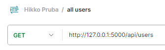

## Prueba_Hikko
Prueba para evaluar mi nivel de Python

El proyecto el una API que se inicializa desde un script.

## Pre-Requisitos
- Tener Python 3 instalado 
    - (la aplicación se desarrolló con Python 3.11.3, por lo que se recomienda tener como mínimo esa versión)
- Tener Pip instalado 
    - Si se instalo Python desde la página oficial (https://www.python.org/) entonces ya está instalado

## Requerimientos
#### Flask 3.0.0
Para instalarlo se usa el siguiente comando:
```
pip install Flask
```
Alternativamente, como se incluyo el “requirements.txt” en la carpta “app”, se puede navegar desde la consola a dicha carpeta y ejecutar el comando:
```
pip install -r requirements.txt
```

## Uso
### Inicialización 
El punto de entrada a la aplicacion es el archivo **app/main.py**. 

Además de descargar el repositorio, también hay que tener preparados los archivos “.json” con los usuario (todos tienen que estar dentro de una misma carpeta). Esta carpeta puede ser la carpeta “/examples/data” de este proyecto, o una carpeta cualquiera del dispositivo local.

Una vez lo anterior este prepara, se ejecuta desde una consola el comando:
```
Python <ruta de /main.py> <Ruta a la carpeta con los archivos “.json”>
```

Se puede omitir el parámetro con la ruta a las carpeta de los archivos (en cuyo caso su usara la ruta por defecto, definida en "./app/config.json"):
```
Python <ruta de /main.py>
```

### Endpoints
- Ruta base: no se configuro ni la ruta ni el puerto, por lo que se usaran los por defecto:
    - ruta_base = http://127.0.0.1:5000

Lo requerido se implementó mediante 2 endpoints REST:

- Para obtener todos los usuarios, con los usuarios que los siguen:

| GET | <ruta_base>/api/users |
| ----------- | ----------- |
| HEADERS | NONE |
| PARAMS | NONE |
| BODY | NONE |

- Para obtener el usuario con menos seguidores (aleatorio entre los posibles, si hay menos que 1):

| GET | <ruta_base>/api/users/leastfollowed |
| ----------- | ----------- |
| HEADERS | NONE |
| PARAMS | NONE |
| BODY | NONE |


### Ejemplos de uso

- Los ejemplos se realizaron con los datos provistos para la prueba (también se subieron en la carpeta **/ejemplos/data**) 

---

Obtener el usuario con menos seguidores:

- Request:



- Response (no se muestra en la totalidad):


---

Obtener el usuario con menos seguidores:

- Request:


- Response:


---

### Contenidos

|Archivo|Descripcion|
|-------|-----------|
|README.md|Documentación del proyecto|
|.gitignore|Archivos que git ignora.|
|./examples/data/|Datos de prueba.|
|./documentacion/|Carpeta para archivos usados para complemetar la documentación (en este caso solo imagenes usadas en la seccion **"Ejemplos de uso"**).|
|./app/requirements.txt|Imports (dependencias) del proyecto. Nno incluye imports estandar de Python como "os", "json", "sys", etc, ni dependencias internas (a otros archivos del mismo proyecto) (de puede usar con "pip install" como se mostro anteriormente para descargar dichas dependencias).|
|./app/main.py|Punto de entrada a la aplicacion, donde se instnacian los servicios a utilizar.|
|./app/constants.py|Punto centralizado donde se mantienen las contantes utilizadas en multiples puntos del proyecto.|
|./app/config.json|Archivo de configuracion. Lo unico que configura es la ruta por defecto de los datos (usuarios)|
|./app/utils/|Carpeta donde se implmenetan funcionalidades generica que se usan o podrian llegar a usarse en varias partes del proyecto|
|./app/utils/users.py|Funcionalidad referente a los usuarios. En este caso crearlos en distintos formatos o realizar operacion sobre listas de ellos.|
|./app/utils/script_inputs.py|Funcionalidad relacionada a los parametros que el se esperan al inicializar la aplicacion (En este caso, solo la ruta a la carpeta con los archivos ".json" con los usuarios).|
|./app/utils/custom_decorators.py|Decoradores implementados manualmente. En este caso, el unico implementado ("**singleton(...)**") permite mantener una unica instancia en toda aplicacion de las calses a la que se aplique.|
|./app/routes/|Carpeta para los archivos donde se defininen los endpoints de la API|
|./app/routes/users.py|Aqui se definien los endpoints correspondiente a la ruta **"/api/users"**.|
|./app/data_access/|Carpeta donde se implementa la lectura de datos externos a la aplicacion.|
|./app/data_access/users.py|Aqui se implementa la carga de usuarios desde archivos **".json"**.|

## ACLARACIONES
1. Se asumió que todos valores de "users_following" se corresponden a un "user_id" que si existe
2. No se contempló la posibilidad de "user_id" duplicados
3. Se asumió que todos los archivos “.json” tienen usuarios en el formato mostrado en la letra de la prueba, y que solo hay un usuario por archivo
